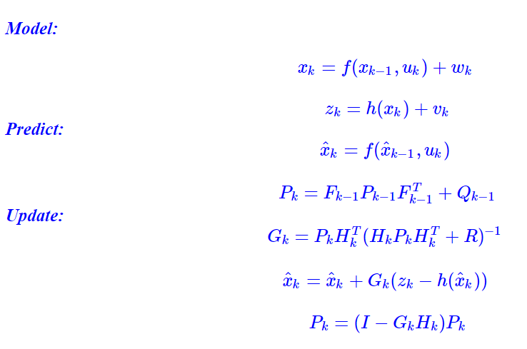
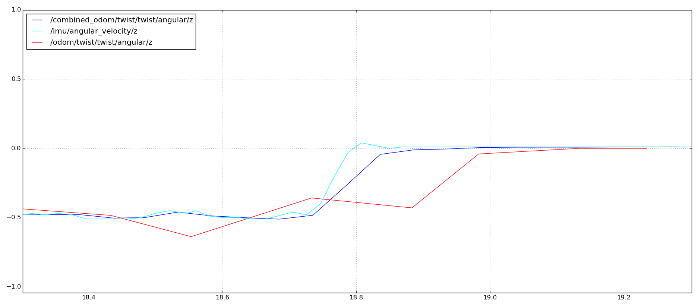

# IMU Sensor Fusion
This is our final project for Computational Robotics class to incorporate a razor IMU sensor to improve the neato's wheel odometry. 
Link to website:
https://xiaozhengxu.github.io/CompRobo_IMU_Sensor_fusion/

# Final project documentation

This week we started with doing validation with april tags and running drive square on the neatos again using the combined odometry from our filter. 

First, we had to modify our proportional control drive square program to make it run from any starting position in the odom frame. Then we faced the challenge of a drifting imu yaw. We solved this by writing the code to find the initial gyro offset (either 0.01 or -0.01), and subtract it from our gyro angular velocity_z measurements. This is the same thing as what sending a gyro offset parameter to the arduino does. (as we looked into the arduino code and they also subtracted what ever the offset parameter was in each velocity_z update). 

After that, we were able to drive the neatos in a square while we disturb it at various turn angles. 
If we are just using the wheel's odometry this is what happens when we disturb the neatos (lift it up slightly and prevent it from turning fully):

As you can see, the wheel odometry is not smart enough because it is solely based on how much the wheels turn. It thinks the robot has turned to an angle when the wheels turn even if the robot is not actually turning. On the other hand, it can't tell when the robot actually turned if it's wheels did not turn. An imu measurement of angular velocity solves this problem. When we combine the angular velocity measurement from the imu, we get a much more realistic result and the neatos is able to drive in a square while being disturbed! (as shown below)

This screen shot video below shows our filter's theta output and the odometry theta's output during the above drive square video. 

While the theta from Odometry is in discrete increments, the theta output from our kalman filter is smooth and accurate to the real world. 

We also experimented with writing a linear kalman filter based on the imu's acceleration measurements to get position values. This did not work out very well because there is always a z acceleration close to 10, but not exactly 10, and that propogates to the x and y directions if the accelerometer is not exactly horizontal. This little acceleration causes the position derived from the kalman filter to increase quadraticly (up to 60,000 meters in less than 1 min). This it is very hard to get accurate position values from accelerometer. 

We also tried to implement our extended kalman filter in cpp, we got to initializing all ros node, publisher and subscriber in a object oriented structure. That was much more complicated than in python and as the examples online were all in a non class structure.

# Phase 2
This week we read through a useful, easy to read tutorial explaining the extended kalman filter. https://home.wlu.edu/~levys/kalman_tutorial/

Then we implemented an extended kalman filter based on a simple non linear model, using the standard extended kalman filter formula found from the tutorial:

The model is based on the state variables x_k = [x,y,theta, v, w], 

and z_k = [v_odom, w_odom, w_imu]. 

x, y, and theta are the position and heading of the robot in the odom frame. v is its forward velocity, and w is its angular velocity (theta_dot). Motor commands were not included in the model. 
This simple model only uses one angular rate measurement from the gyro in the imu (w_imu), and does not include the acceleration measurements from the accelerometer, nor the orientation measurements from the magnotometer. 

Note that the function f(x_k) is non-linear because a change in x, y involves cos(theta)*v*dt and sin(theta)*v*dt, but the sensor function h(z_k) is linear and so can be represented as a constant matrix H_k. 

Our filter has inputs from odometry based on wheel encoders, which is very noisy when the robot turns on carpet. Thus, for the noise estimate values we gave it a high covariance for w_odom. The imu measurement of angular velocity is much less noisy, varying only by 0.02. 

We tried running our filter using these estimates and turning the robot in place (as in the bag files under bags/turning_180_deg) 

The image shows the angular turning rate from odom measurement, imu measurement and our filter output measurement in combined_odom.
The combined odom favored the imu measurement because of the low noise we set. If we reversed the noise amplitude for the two sensors, the combined odom would favor the odom measurement instead. 

We then collected some more bag files including april tag pose estimates to validate our orientation estimate. 

On the testing side we plan to re-run behaviors from the warmup project like drive square to see how accurate the combined_odom is.

Our next steps are incorporating acceleration measurements from the imu into the kalman filter we have.

April 28th, 2017

# Phase 1

This week our goal was to read IMU data from the arduino, pass it through the pi and publish the data as an IMU message on ROS. 

First, we learned about the neato’s software structure, as shown in the diagram below.

The IMU has an ATmega 328P microcontroller, which is flashed with the Arduino bootloader. This communicates with the raspi through an FTDI USB-UART converter. On the raspi there is code to read from the arduino through serial and send the data through a web socket to the laptop. 

We were in charge of writing the bridge that takes the data sent from the raspi and publishes it to ROS. To do that, we referenced and used the code on https://github.com/KristofRobot/razor_imu_9dof as a starting point. The imu_node.py in this repo read the imu data directly from serial and published it to ROS. What we had to change was to read from a web socket instead. 

In that process, first we learned about UDP and TCP communication protocols. We decided to establish a connection between the raspi and laptop with TCP and then use the IP of the laptop address to send the data packets in UDP. The advantage of UDP should have been that it sends the entire data in one pack, but that wasn’t the case for us, so we had to write our own receive all function. 
After some more editing the code we were able to publish the IMU data to ROS! 

We also changed imu_node.py to follow an object oriented code architecture. 

In order to get odometry and IMU data at the same time, we are required to run a bunch of ROS nodes all at the same time, a perfect use case for launch files! Our launch file takes a `host` argument which we pass to the launch structure from the neato node to establish the standard connection to the robot. We also start up our IMU node, which established the connection between the raspi and IMU, then begins publishing data. We briefly experimented with also starting a Robot Pose EKF node, but decided that the point of this project is to learn about Kalman filters, not just use one that is already built. 

We had some issues running both the neato node and IMU node at the same time, which resulted in the serial communication to both the neato and IMU failing. We’re currently resolving this by plugging in the IMU after we have started up the neato. 

Now that we can access both Odometry data from the neato’s wheels and imu data, we are ready to start implementing an extended Kalman filter! 

April 21st, 2017
